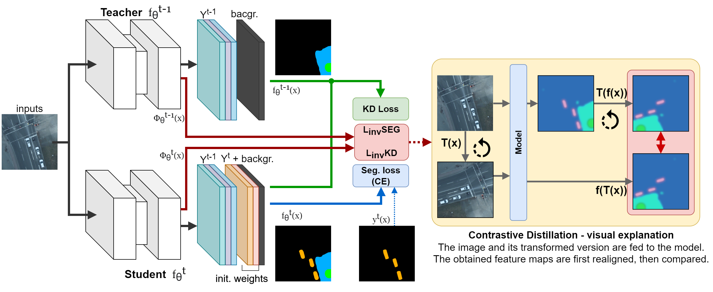
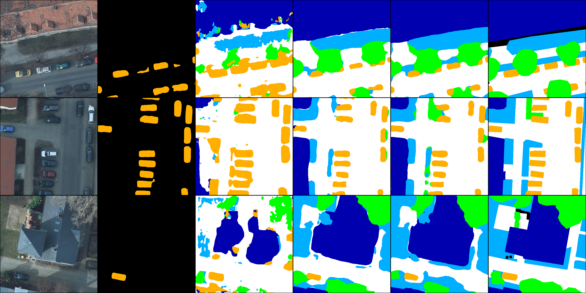

# A Contrastive Distillation Approach for Incremental Semantic Segmentation in Aerial Images

[](https://arxiv.org/abs/2112.03814)

> Accepted for publication at [ICIAP 2021](https://www.iciap2021.org/).

## Introduction
MiB-CD is an Incremental Learning framework tailored for Semantic Segmentation in aerial images.
The basic idea is to exploit the arbitrariness of rotations in top-down pictures to introduce a novel regularization that forces models to produce similar feature maps, regardless of the orientation.



Example outputs, from left to right: 

RGB input, finetuning, Unbiased CE (MiB) + Contrastive Distillation, MiB, MiB + Contrastive Distillation, ground truth.



## Quickstart

### Just bring me to the interesting part
Absolutely! The interesting bit is during training, [this is a good starting point](https://github.com/edornd/contrastive-distillation/blob/main/saticl/trainer/invariance.py#L86). Comments and code should be enough to get you started.

### How to
The entrypoint for the whole pipeline is the run.py script. The project is using `click` and `pydantic` to handle configuration objects with static typing to help with readability and coding inside the IDE.
Of course, the order of commands to execute is: `prepare`, `train` and `test`. Specifically:

1. First, you'll need to download the Potsdam dataset from here. There should be some minor folder renaming involved (lowercase names), check [saticl/preproc/isprs.py](https://github.com/edornd/contrastive-distillation/blob/main/saticl/preproc/isprs.py) for more details about the folder structure.

2. Install the requirements with `pip install -r requirements.txt`. I skimmed useless dependencies from it, but never really had time to test it. If I missed some, please let me know, thanks!

2. Run `python run.py prepare --src=<your data source> --dst=<your destination>` to produce a preprocessed and tiled version of the dataset. The command offers other options, such as `channels` (RGB, RGBIR) or `overlap` (112 for instance is a good compromise for Potsdam).
Use `python run.py prepare --help` for more info.

3. Run `python run.py train` overriding all the required parameters. You can find some examples in the [scripts](https://github.com/edornd/contrastive-distillation/tree/main/scripts) folder.
As always, use `python run.py train --help` for more info.
Each script automatically starts the ICL flow, one task at a time, in a loop. You can also manually launch a given task and step, provided that the previous ones are available.
**Example:**
```bash
#!/usr/bin/env bash

CUDA=0
PORT=1234
NAME=rgb-mib-cd
DATA_ROOT="<PREPROCESSED FOLDER PATH>"
COMMENT="Retraining with RGB, rot. invariance on both new and old, factor 0.1, flip+rot90"

for STEP in {0..4}
do
    echo "===| Launching step ${STEP}... |==="

    CUDA_VISIBLE_DEVICES=$CUDA accelerate launch --config configs/single-gpu.json --main_process_port $PORT run.py train \
    --data-root $DATA_ROOT \
    --model.encoder=tresnet_m \
    --task.name 6s \
    --task.step $STEP \
    --task.filter-mode=split \
    --model.act=ident \
    --model.norm=iabn_sync \
    --trainer.batch-size=8 \
    --trainer.amp \
    --trainer.patience=25 \
    --optimizer.lr=1e-3 \
    --scheduler.target=cosine \
    --in-channels=3 \
    --aug.factor=0.1 \
    --aug.factor-icl=0.1 \
    --aug.fixed-angles \
    --name=$NAME \
    --comment $COMMENT
done
```
